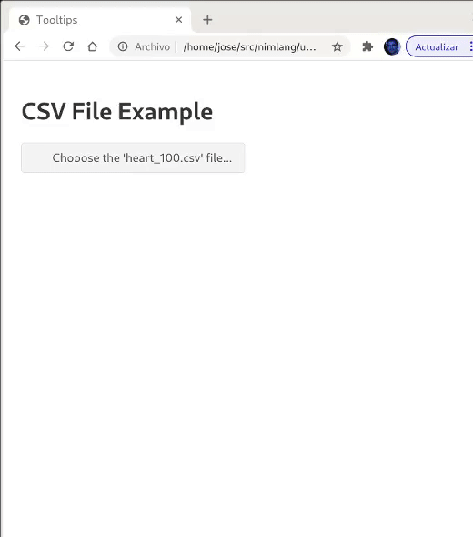

# Introduction
This library wraps javascript library [μPlot](https://github.com/leeoniya/uPlot) in Nim. It is based on canvas so it is pretty fast (in my computer -an old i7 with 8Gb- handles pretty well more than 1 million points-).

This library enables plotting time series [like this](https://leeoniya.github.io/uPlot/demos/index.html).

As an example, the following animation shows how two series of 650000 points are loaded and shown interactively in the browser. It takes about 5sec to load and then it works really well:



# How to use it
Create an .html file (see the example: [ex01_basic.html](https://github.com/mantielero/uplot.nim/blob/main/examples/ex01_basic.html))

> Make sure that the html refers to the appropriate .js/.css dependencies (well locally or well in internet)

Create a nim file like: [ex01_basic.nim](https://github.com/mantielero/uplot.nim/blob/main/examples/ex01_basic.nim).

Compile it like:
```
nim js -d:release ex01_basic.nim
```

> this will create the file `ex01_basic.js`

Open the .html file in the browser.

Probably this could be combined with Neel or with Nimview.
